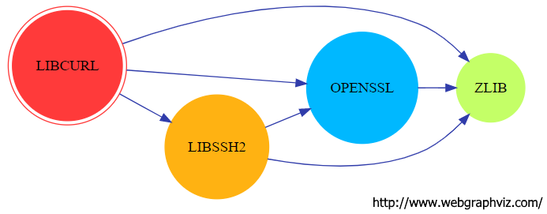
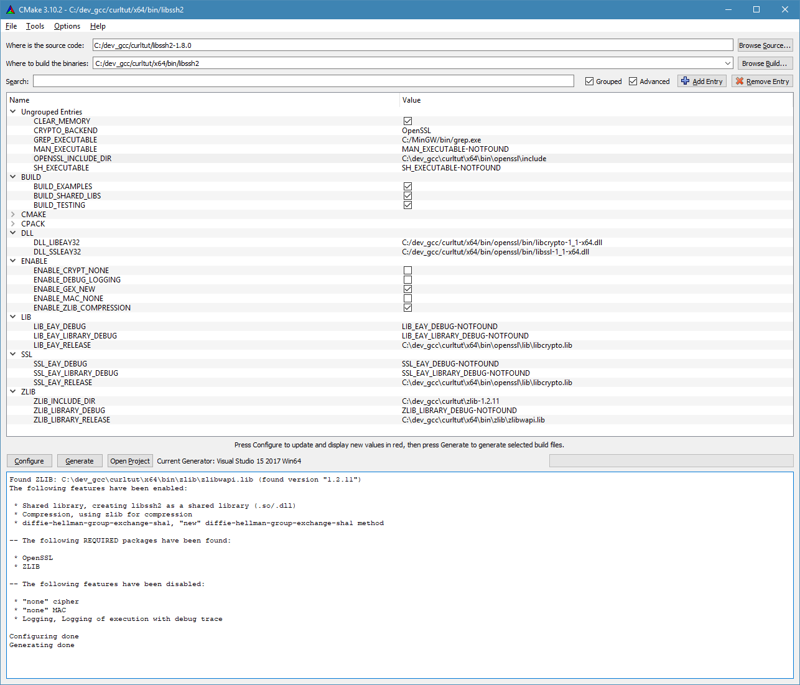

# Building libcurl 7.58.0 on windows
### Development environment
* [Visual studio 2017 community edition](https://www.visualstudio.com/it/vs/community/)
* [Activeperl 5.24.1](https://www.activestate.com/activeperl)
* [Nasm 2.12.02](http://www.nasm.us/)
* [Cmake 3.10.2](https://cmake.org/)

My dev root is `c:\dev_gcc\` - I know, we are not using gcc ;)

### Activeperl installation
Download and run 	`Windows Installer (EXE)`, remeber to add `perl.exe` to `PATH` system variable

### Nasm installation
* Download zipped binaries
* Unizp in a foler
* Add nasm.exe to `PATH` system variable

### CMake installation
Download and run `Windows win64-x64 Installer`

### Libcurl libaries dependencies:



### ZLIB 1.2.11

[https://www.zlib.net/](https://www.zlib.net/)

* Download zlib source code, unzip in: `curltut\zlib-1.2.11`
* Open folder: `curltut\zlib-1.2.11\contrib\vstudio\vc14`
* Open solution file with VS2017 `zlibvc.sln` change output path to `..\..\..\..\x64\bin\zlib\`
* Build solution
  * binaries: `curltut\x64\bin`
  * zlib ddl file: `zlibwapi.dll`

**Note**:
> To use zlibwapi.dll in your application, you must define the macro ZLIB_WINAPI when compiling your application's source files.

### OPENSSL 1.1.0g

[https://www.openssl.org/source/](https://www.openssl.org/source/)

* Download sources	`openssl-1.1.0g.tar.gz`, unizp in `curltut\openssl-1.1.0g`
* Open VS2017 x64 command prompt
* Take a look at configuration flags: `openssl-1.1.0g\INSTALL`
* Execute this commands:
```
set PATH=C:\dev_gcc\curltut\x64\bin\zlib;%PATH%

cd curltut\openssl-1.1.0g

perl Configure VC-WIN64A-masm zlib --openssldir=c:\dev_gcc\curltut\x64\bin\openssl --prefix=c:\dev_gcc\curltut\x64\bin\openssl --with-zlib-include=C:\dev_gcc\curltut\zlib-1.2.11 --with-zlib-lib=C:\dev_gcc\curltut\x64\bin\zlib\zlibwapi.lib

nmake clean

nmake

nmake test

nmake install
```
* Binaries: `curltut\x64\bin\openssl`

### libssh2 1.8.0

[https://www.libssh2.org/](https://www.libssh2.org/)

* Download sources and unzip in `curltut\libssh2-1.8.0`
* Open command prompt:
```
cd curltut\libssh2-1.8.0
mkdir ..\x64\bin\libssh2
```
* Open CMake-GUI.exe
* 
* Changes:
```
Ungrouper Entries
	CRYPTO_BACKEND = OpenSSL
	OPENSSL_INCLUDE_DIR = C:\dev_gcc\curltut\x64\bin\openssl\include
BUILD
	BUILD_SHARED_LIBS = True
DLL
	DLL_LIBEAY32 = C:/dev_gcc/curltut/x64/bin/openssl/bin/libcrypto-1_1-x64.dll
	DLL_SSLEAY32 = C:/dev_gcc/curltut/x64/bin/openssl/bin/libssl-1_1-x64.dll
ENABLE
	ENABLE_ZLIB_COMPRESSION = True
LIB
	LIB_EAY_RELEASE = C:\dev_gcc\curltut\x64\bin\openssl\lib\libcrypto.lib
SSL
	LIB_EAY_RELEASE = C:\dev_gcc\curltut\x64\bin\openssl\lib\libcrypto.lib
ZLIB
	ZLIB_INCLUDE_DIR = C:\dev_gcc\curltut\zlib-1.2.11
	ZLIB_LIBRARY_RELEASE = C:\dev_gcc\curltut\x64\bin\zlib\zlibwapi.lib
```

* Open solution file with VS2017 `curltut\x64\bin\libssh2\libssh2.sln` and build configuration `Release`
* Binaries: `curltut\x64\bin\libssh2\src\Release`

### libcurl 7.58.0

[https://curl.haxx.se/download.html](https://curl.haxx.se/download.html)

* Download zip sources and unzip in: `curltut\curl-7.58.0`
* Open command prompt:
```
cd curltut\curl-7.58.0
mkdir ..\x64\bin\libcurl
```
* Open solution file with VS2017 `curltut\curl-7.58.0\projects\Windows\VC15\curl-all.sln`
* Select configuration `DLL Release - DLL OpenSSL - DLL LibSSH2`
* For each project change output folder to: `c:\dev_gcc\curltut\x64\bin\libcurl`
* Project `libcurl`, add this preprocessor defines:
  * `HAVE_LIBZ`
  * `HAVE_ZLIB_H`
* Project `libcurl`, modify include paths:
  * `C:\dev_gcc\curltut\x64\bin\openssl\include`
  * `C:\dev_gcc\curltut\libssh2-1.8.0\include`
  * `C:\dev_gcc\curltut\zlib-1.2.11`
* Project `libcurl`, modify library paths:
  * `C:\dev_gcc\curltut\x64\bin\openssl\lib`
  * `C:\dev_gcc\curltut\x64\bin\libssh2\src\Release`
  * `C:\dev_gcc\curltut\x64\bin\zlib`
* Project `libcurl`, modify libaries:
  * `libssl.lib` (and remove `ssleay32.lib`)
  * `libcrypto.lib` (and remove `libeay32.lib`)
  * `zlibwapi.lib`
* Build
* Binaries: `curltut\curl-7.58.0\build\Win64\VC15\DLL Release - DLL OpenSSL - DLL LibSSH2`

**Notes**

during building if there is an error about missing `stdio.h`
use command `ridestina progetti` on solution root, select your last windows SDK available